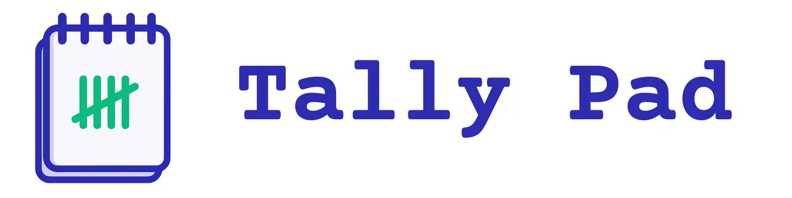

# TallyPad: The Last Scoresheet You'll Ever Need

Welcome to TallyPad! This project is a simple, beautiful, and free scorekeeper designed for all your favorite card and board games. We built TallyPad to help you focus on the fun of game night, not the math. 🎲

## ✨ Key Features

- **Multiple Game Templates:** TallyPad comes with pre-built scorecards for popular games like Yahtzee, Phase 10, Golf, and Putt-Putt, plus a simple scorecard for any game.
- **Privacy-First Design:** All your game data is stored locally in your browser. We don't collect or store any of your personal information.
- **Mobile-Friendly:** TallyPad is designed to work beautifully on your phone, making it the perfect companion for game night on the go.
- **Save Custom Golf Courses:** For golf and putt-putt lovers, you can save your favorite course layouts and reuse them anytime.
- **Open Source:** TallyPad is completely free and open source. You can view the code, contribute to the project, and even host it yourself.

## 💻 Tech Stack

TallyPad is built with a modern, performance-focused tech stack:

- **Next.js:** A powerful React framework for building fast, user-friendly web applications.
- **TypeScript:** For writing clean, maintainable, and type-safe code.
- **Tailwind CSS:** A utility-first CSS framework for creating beautiful, custom designs without writing a single line of custom CSS.
- **PouchDB:** A fast, in-browser database that allows TallyPad to work completely offline.

## 🚀 Getting Started

To get a local copy up and running, follow these simple steps.

### Prerequisites

- Node.js (v20 or higher)
- npm, yarn, or pnpm

### Installation

1.  Clone the repo
    ```sh
    git clone [https://github.com/onebuffalolabs/tally-pad.git](https://github.com/onebuffalolabs/tally-pad.git)
    ```
2.  Install NPM packages
    ```sh
    npm install
    ```
3.  Run the development server
    ```sh
    npm run dev
    ```

## Built with ❤️ by One Buffalo Labs

TallyPad is a passion project from [One Buffalo Labs](https://onebuffalolabs.com), a digital product studio that loves building cool stuff. We hope you enjoy using it as much as we enjoyed building it!
